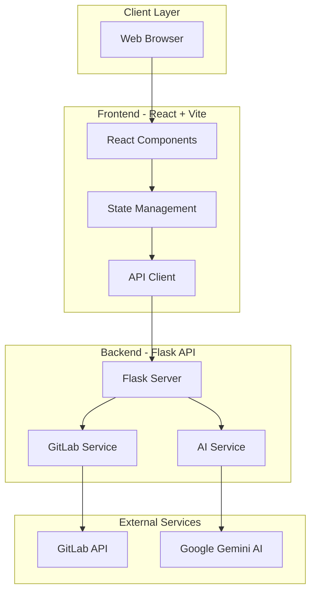
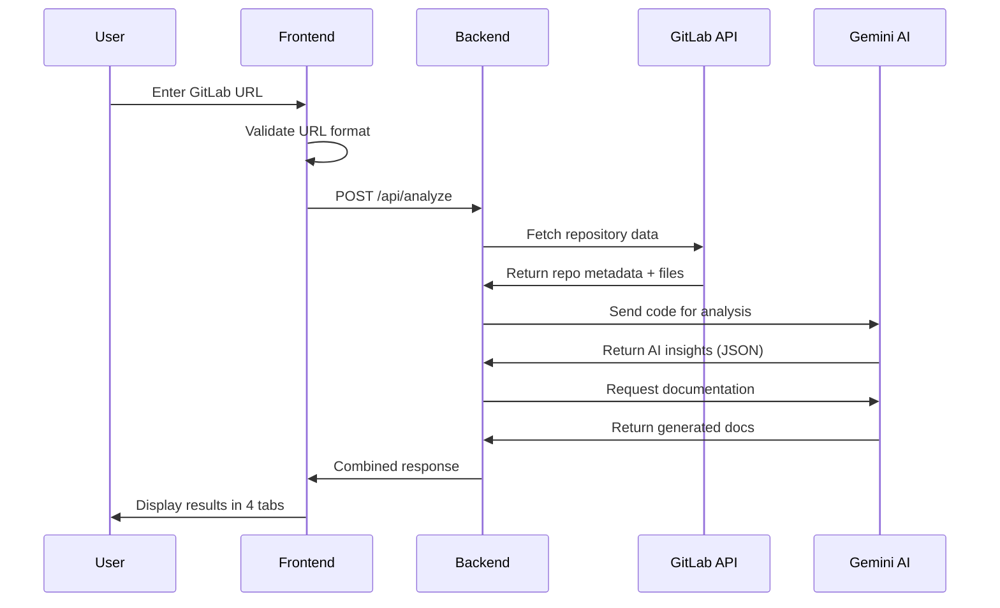
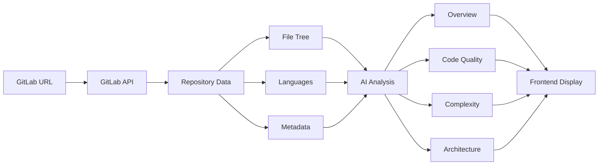

## 🏗️ Architecture & Design

### System Architecture



### Application Flow



### Component Architecture

#### Frontend Components

```
frontend/src/
├── App.jsx                 # Main application component
├── components/
│   ├── Hero.jsx           # Landing page hero section
│   ├── AnalysisForm.jsx   # URL input + demo button
│   ├── LoadingSpinner.jsx # Animated loading with progress
│   └── ResultsDisplay.jsx # 4-tab results interface
└── index.css              # Global styles + Tailwind
```

**Component Flow:**
1. `App.jsx` - Root component, manages global state
2. `Hero.jsx` - Shows initially, explains features
3. `AnalysisForm.jsx` - Captures user input, validates URL
4. `LoadingSpinner.jsx` - Shows during API call (15-30s)
5. `ResultsDisplay.jsx` - Displays results in tabs

#### Backend Services

```
backend/
├── app.py                    # Flask application entry point
└── services/
    ├── gitlab_service.py     # GitLab API integration
    └── ai_service.py         # Gemini AI integration
```

**Service Responsibilities:**

**GitLabService:**
- Authenticate with GitLab API
- Fetch repository metadata
- Retrieve file tree structure
- Get language statistics
- Handle API rate limiting

**AIService:**
- Initialize Gemini AI client
- Format prompts for analysis
- Parse AI JSON responses
- Generate fallback data if AI fails
- Handle API errors gracefully

### Data Flow



### Design Patterns Used

1. **Component-Based Architecture (Frontend)**
   - Reusable React components
   - Single Responsibility Principle
   - Props for data passing

2. **Service Layer Pattern (Backend)**
   - Separation of concerns
   - Business logic in services
   - Flask routes only handle HTTP

3. **Repository Pattern (Implied)**
   - GitLabService abstracts data fetching
   - Clean interface for external APIs

4. **Error Handling Pattern**
   - Try-catch blocks at every layer
   - Fallback data when AI fails
   - User-friendly error messages

---

## 📁 Project Structure

### Complete Directory Tree

```
repoinsight-ai/
│
├── frontend/                          # React Frontend
│   ├── public/                        # Static assets
│   ├── src/
│   │   ├── components/
│   │   │   ├── AnalysisForm.jsx      # URL input form + validation
│   │   │   ├── Hero.jsx              # Landing page hero
│   │   │   ├── LoadingSpinner.jsx    # Progress indicator
│   │   │   └── ResultsDisplay.jsx    # 4-tab results view
│   │   ├── App.jsx                   # Root component
│   │   ├── index.css                 # Tailwind styles
│   │   └── main.jsx                  # React entry point
│   ├── .env                          # Frontend environment variables
│   ├── Dockerfile                    # Frontend container config
│   ├── nginx.conf                    # Nginx configuration
│   ├── package.json                  # NPM dependencies
│   ├── postcss.config.js             # PostCSS configuration
│   ├── tailwind.config.js            # Tailwind customization
│   └── vite.config.js                # Vite build configuration
│
├── backend/                           # Flask Backend
│   ├── services/
│   │   ├── ai_service.py             # Gemini AI integration
│   │   └── gitlab_service.py         # GitLab API wrapper
│   ├── .env                          # Backend environment variables
│   ├── app.py                        # Flask application
│   ├── Dockerfile                    # Backend container config
│   └── requirements.txt              # Python dependencies
│
├── .gitlab/
│   └── ci/
│       └── environments.yml          # CI/CD environment configs
│
├── monitoring/
│   └── health_check.py               # Service health monitoring
│
├── scripts/
│   └── ai_gitlab_bot.py              # Automation scripts
│
├── .gitignore                        # Git ignore rules
├── .gitlab-ci.yml                    # CI/CD pipeline definition
├── docker-compose.yml                # Multi-container orchestration
├── LICENSE                           # Project license
├── README.md                         # Quick start guide
├── SETUP_GUIDE.md                    # Detailed setup instructions
├── PROJECT_EXPLANATION.md            # Project overview
└── DETAILED_GUIDE.md                 # This file
```